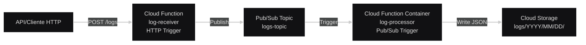
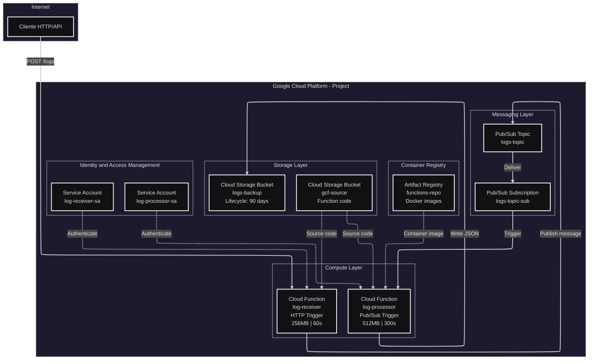
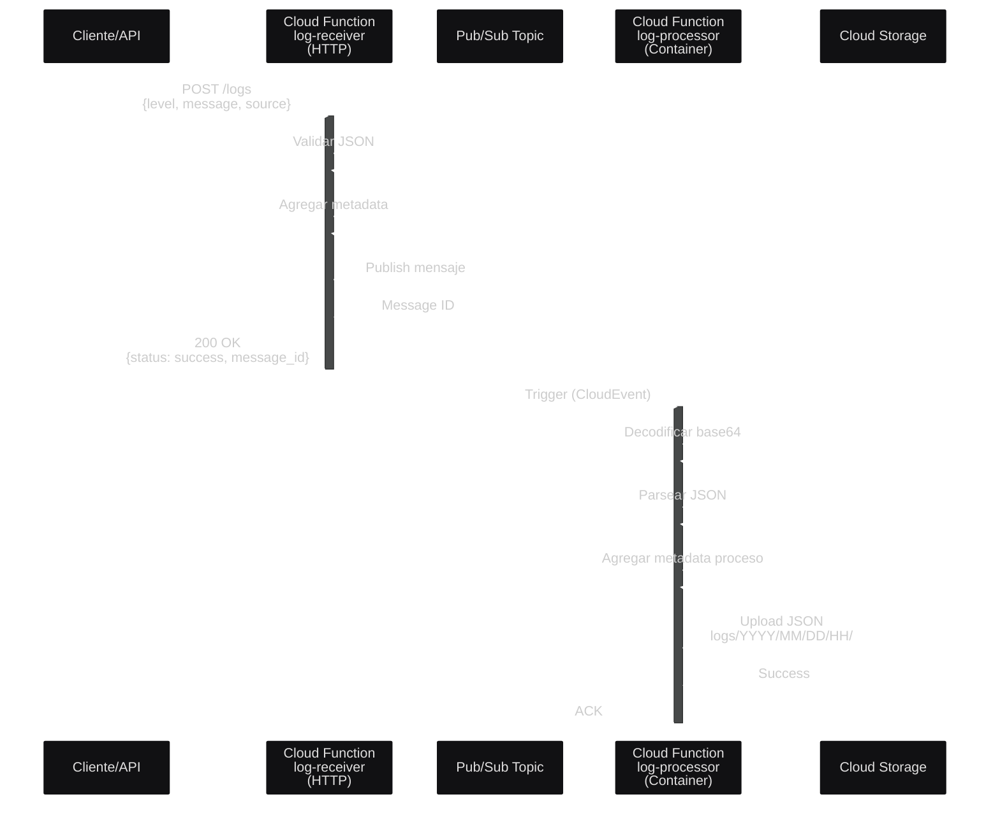
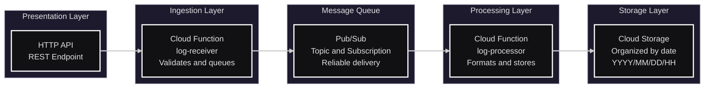

# Sistema de Respaldo de Logs en GCP

Sistema automatizado para recepción, procesamiento y almacenamiento de logs en Google Cloud Platform utilizando Cloud Functions, Pub/Sub y Cloud Storage.

## Tabla de Contenidos

- [Descripción](#descripción)
- [Arquitectura](#arquitectura)
- [Características](#características)
- [Requisitos Previos](#requisitos-previos)
- [Estructura del Proyecto](#estructura-del-proyecto)
- [Instalación](#instalación)
- [Configuración](#configuración)
- [Uso](#uso)
- [Testing](#testing)
- [Monitoreo](#monitoreo)
- [Troubleshooting](#troubleshooting)
- [Licencia](#licencia)

---

## Descripción

Este proyecto implementa una solución serverless en Google Cloud Platform para:

- Recibir logs a través de una API REST
- Procesar logs de forma asíncrona usando Pub/Sub
- Almacenar logs organizados por fecha en Cloud Storage
- Gestionar el ciclo de vida de los logs automáticamente
- Escalar automáticamente según la demanda

### Caso de Uso

Ideal para aplicaciones que necesitan:
- Centralizar logs de múltiples fuentes
- Separar la ingesta del procesamiento de logs
- Almacenamiento de largo plazo con políticas de retención
- Alta disponibilidad y escalabilidad automática
- Bajo costo operacional

---

## Arquitectura

### Diagrama de Arquitectura General



### Diagrama de Componentes



### Diagrama de Secuencia



### Diagrama de Capas



---

## Características

### Funcionalidades Principales

- **API REST HTTP**: Endpoint público para recepción de logs
- **Procesamiento Asíncrono**: Desacoplamiento mediante Pub/Sub
- **Almacenamiento Organizado**: Logs estructurados por año/mes/día/hora
- **Alta Disponibilidad**: Auto-escalado de 0 a 10 instancias
- **Retry Automático**: Reintentos con backoff exponencial
- **Gestión de Ciclo de Vida**: Políticas automáticas de retención

### Características Técnicas

| Característica | Detalles |
|----------------|----------|
| **Infraestructura** | 100% Terraform (IaC) |
| **Serverless** | Sin gestión de servidores |
| **Escalabilidad** | Automática de 0-10 instancias |
| **Retención** | 90 días configurables |
| **Formato** | JSON estructurado |

---

## Requisitos Previos

### Software Requerido

```bash
# Terraform >= 1.5
terraform --version

# Google Cloud SDK
gcloud --version

# Make (opcional pero recomendado)
make --version

# curl (para testing)
curl --version
```

### Permisos GCP Necesarios

```yaml
roles:
  - roles/owner                          # O los siguientes roles específicos:
  - roles/resourcemanager.projectIamAdmin
  - roles/iam.serviceAccountAdmin
  - roles/cloudfunctions.admin
  - roles/storage.admin
  - roles/pubsub.admin
  - roles/artifactregistry.admin
  - roles/cloudbuild.builds.editor
```

### Configuración de GCP

```bash
# Autenticar con GCP
gcloud auth login
gcloud auth application-default login

# Configurar proyecto
gcloud config set project TU_PROYECTO_ID

# Habilitar billing (si no está habilitado)
gcloud beta billing accounts list
gcloud beta billing projects link TU_PROYECTO_ID --billing-account=BILLING_ACCOUNT_ID
```

---

## Estructura del Proyecto

```
sistema-respaldo_logs-gcp/
├── README.md                      # Este archivo
├── main.tf                        # Configuración principal de Terraform
├── variables.tf                   # Variables de Terraform
├── outputs.tf                     # Outputs de Terraform
├── terraform.tfvars              # Valores de variables (no versionar)
├── versions.tf                    # Versiones de providers
├── Makefile                       # Comandos útiles
├── deploy.sh                      # Script de despliegue
├── test.sh                        # Script de testing
├── .gitignore                     # Archivos a ignorar
│
├── receiver-function/             # Cloud Function HTTP
│   ├── main.py                    # Código de la función receptora
│   └── requirements.txt           # Dependencias Python
│
└── processor-function/            # Cloud Function Processor
    ├── main.py                    # Código de la función procesadora
    ├── requirements.txt           # Dependencias Python
    └── Dockerfile                 # Imagen de contenedor
```

---

## Instalación

### Paso 1: Clonar el Repositorio

```bash
git clone https://github.com/diegoinoca/sistema-respaldo_logs-gcp.git
cd sistema-respaldo_logs-gcp
```

### Paso 2: Configurar Variables

Edita `terraform.tfvars` con tus valores:

```hcl
project_id               = "tu-proyecto-gcp"
region                   = "us-central1"
bucket_name              = "tu-proyecto-logs-backup"
topic_name               = "logs-topic"
receiver_function_name   = "log-receiver"
processor_function_name  = "log-processor"
logs_retention_days      = 90
```

### Paso 3: Inicializar Terraform

```bash
make init
# O manualmente:
terraform init -upgrade
```

### Paso 4: Revisar Plan

```bash
make plan
# O manualmente:
terraform plan
```

### Paso 5: Desplegar

```bash
make deploy
# O manualmente:
./deploy.sh
```

### Tiempo de Despliegue

```
Tiempo estimado: 5-10 minutos

Fases:
1. Habilitar APIs (2-3 min)
2. Crear recursos IAM (1 min)
3. Build de contenedor (2-3 min)
4. Deploy de funciones (2-3 min)
```

---

## Configuración

### Variables de Terraform

| Variable | Descripción | Default | Requerida |
|----------|-------------|---------|-----------|
| `project_id` | ID del proyecto GCP | - | Sí |
| `region` | Región de GCP | `us-central1` | No |
| `bucket_name` | Nombre del bucket de logs | - | Sí |
| `topic_name` | Nombre del tópico Pub/Sub | `logs-topic` | No |
| `receiver_function_name` | Nombre función receptora | `log-receiver` | No |
| `processor_function_name` | Nombre función procesadora | `log-processor` | No |
| `logs_retention_days` | Días de retención | `90` | No |

### Variables de Entorno (Functions)

#### log-receiver
```bash
PUBSUB_TOPIC=projects/PROJECT_ID/topics/logs-topic
PROJECT_ID=tu-proyecto-gcp
```

#### log-processor
```bash
BUCKET_NAME=tu-proyecto-logs-backup
PROJECT_ID=tu-proyecto-gcp
```

### Configuración de Lifecycle

```hcl
# Nearline después de 30 días
lifecycle_rule {
  condition {
    age = 30
  }
  action {
    type          = "SetStorageClass"
    storage_class = "NEARLINE"
  }
}

# Eliminar después de 90 días
lifecycle_rule {
  condition {
    age = 90
  }
  action {
    type = "Delete"
  }
}
```

---

## Uso

### Enviar Logs vía API

#### Obtener URL del Endpoint

```bash
# Obtener URL del receiver
RECEIVER_URL=$(terraform output -raw receiver_url)
echo $RECEIVER_URL
```

#### Formato de Log

```json
{
  "level": "INFO|WARNING|ERROR|DEBUG",
  "message": "Mensaje del log",
  "source": "nombre-aplicacion",
  "timestamp": "2026-01-07T12:00:00Z",  // Opcional
  "metadata": {                          // Opcional
    "user_id": "12345",
    "request_id": "abc-123",
    "custom_field": "valor"
  }
}
```

#### Ejemplos de Uso

**Ejemplo 1: Log INFO básico**
```bash
curl -X POST "$RECEIVER_URL" \
  -H "Content-Type: application/json" \
  -d '{
    "level": "INFO",
    "message": "Usuario autenticado correctamente",
    "source": "auth-service",
    "metadata": {
      "user_id": "user-12345"
    }
  }'
```

**Ejemplo 2: Log ERROR con stack trace**
```bash
curl -X POST "$RECEIVER_URL" \
  -H "Content-Type: application/json" \
  -d '{
    "level": "ERROR",
    "message": "Error en conexión a base de datos",
    "source": "api-service",
    "metadata": {
      "error_code": "DB_CONNECTION_FAILED",
      "stack_trace": "Error: Connection timeout..."
    }
  }'
```

**Ejemplo 3: Log con timestamp personalizado**
```bash
curl -X POST "$RECEIVER_URL" \
  -H "Content-Type: application/json" \
  -d '{
    "level": "WARNING",
    "message": "Límite de rate limit alcanzado",
    "source": "api-gateway",
    "timestamp": "'$(date -u +%Y-%m-%dT%H:%M:%SZ)'",
    "metadata": {
      "ip_address": "192.168.1.100",
      "endpoint": "/api/v1/users"
    }
  }'
```

#### Respuesta Esperada

```json
{
  "status": "success",
  "message": "Log received and queued for processing",
  "message_id": "1234567890",
  "timestamp": "2026-01-07T12:00:00Z"
}
```

### Consultar Logs Almacenados

#### Listar logs por fecha

```bash
# Listar logs de hoy
gsutil ls "gs://$BUCKET_NAME/logs/$(date +%Y/%m/%d)/"

# Listar logs de una fecha específica
gsutil ls "gs://$BUCKET_NAME/logs/2026/01/07/"

# Listar logs de una hora específica
gsutil ls "gs://$BUCKET_NAME/logs/2026/01/07/14/"
```

#### Ver contenido de un log

```bash
# Ver último log
gsutil cat $(gsutil ls -r "gs://$BUCKET_NAME/logs/**" | tail -1)

# Ver log específico
gsutil cat "gs://$BUCKET_NAME/logs/2026/01/07/14/log_20260107_143025_123456.json"
```

#### Descargar logs

```bash
# Descargar todos los logs de un día
gsutil -m cp -r "gs://$BUCKET_NAME/logs/2026/01/07/" ./logs-local/

# Descargar logs de una hora específica
gsutil -m cp "gs://$BUCKET_NAME/logs/2026/01/07/14/*" ./logs-local/
```

#### Buscar en logs

```bash
# Buscar logs que contengan un texto específico
gsutil cat "gs://$BUCKET_NAME/logs/2026/01/07/**/*.json" | grep "ERROR"

# Contar logs por nivel
gsutil cat "gs://$BUCKET_NAME/logs/2026/01/07/**/*.json" | jq -r '.level' | sort | uniq -c
```

---

## Testing

### Tests Automatizados

```bash
# Ejecutar suite de tests
make test

# O manualmente:
./test.sh
```

### Tests Manuales

#### Test 1: Verificar Endpoint

```bash
RECEIVER_URL=$(terraform output -raw receiver_url)

# Debe retornar 200 OK
curl -X POST "$RECEIVER_URL" \
  -H "Content-Type: application/json" \
  -d '{"level":"INFO","message":"test","source":"manual-test"}'
```

#### Test 2: Verificar Procesamiento

```bash
# Enviar log
curl -X POST "$RECEIVER_URL" \
  -H "Content-Type: application/json" \
  -d '{"level":"INFO","message":"test-processing","source":"test"}'

# Esperar 30 segundos
sleep 30

# Verificar que el log se guardó
BUCKET_NAME=$(terraform output -raw bucket_name)
gsutil ls -r "gs://$BUCKET_NAME/logs/$(date +%Y/%m/%d)/"
```

#### Test 3: Verificar Retry

```bash
# Ver logs de la función procesadora
gcloud functions logs read log-processor \
  --gen2 \
  --region=us-central1 \
  --limit=20
```

### Métricas de Testing

```bash
# Ver invocaciones de la función receptora
gcloud monitoring time-series list \
  --filter='metric.type="cloudfunctions.googleapis.com/function/execution_count" AND resource.labels.function_name="log-receiver"' \
  --format=json

# Ver errores
gcloud monitoring time-series list \
  --filter='metric.type="cloudfunctions.googleapis.com/function/execution_count" AND metric.labels.status!="ok"' \
  --format=json
```

---

## Monitoreo

### Cloud Console

1. **Cloud Functions Dashboard**
   ```
   https://console.cloud.google.com/functions
   ```

2. **Logs Explorer**
   ```
   https://console.cloud.google.com/logs
   ```

3. **Cloud Storage Browser**
   ```
   https://console.cloud.google.com/storage
   ```

### Comandos de Monitoreo

#### Ver logs en tiempo real

```bash
# Logs de la función receptora
gcloud functions logs read log-receiver \
  --gen2 \
  --region=us-central1 \
  --limit=50

# Logs de la función procesadora
gcloud functions logs read log-processor \
  --gen2 \
  --region=us-central1 \
  --limit=50

# Seguir logs en tiempo real
gcloud functions logs read log-processor \
  --gen2 \
  --region=us-central1 \
  --limit=50 \
  --format="table(time, message)"
```

#### Métricas de Performance

```bash
# Invocaciones por minuto
gcloud monitoring time-series list \
  --filter='metric.type="cloudfunctions.googleapis.com/function/execution_count"' \
  --interval-start-time="$(date -u -d '1 hour ago' +%Y-%m-%dT%H:%M:%SZ)" \
  --interval-end-time="$(date -u +%Y-%m-%dT%H:%M:%SZ)"

# Latencia promedio
gcloud monitoring time-series list \
  --filter='metric.type="cloudfunctions.googleapis.com/function/execution_times"' \
  --format=json
```


## Troubleshooting

### Problemas Comunes

#### 1. Error: "API not enabled"

```bash
# Solución: Habilitar APIs manualmente
gcloud services enable cloudfunctions.googleapis.com
gcloud services enable run.googleapis.com
gcloud services enable pubsub.googleapis.com
gcloud services enable storage.googleapis.com
gcloud services enable cloudbuild.googleapis.com
gcloud services enable artifactregistry.googleapis.com
```

#### 2. Error: "Permission denied"

```bash
# Verificar permisos
gcloud projects get-iam-policy PROJECT_ID

# Agregar permisos faltantes
gcloud projects add-iam-policy-binding PROJECT_ID \
  --member="user:tu-email@example.com" \
  --role="roles/owner"
```

#### 3. Error: "Bucket already exists"

```bash
# Cambiar nombre del bucket en terraform.tfvars
bucket_name = "nombre-unico-diferente-logs-backup"
```

#### 4. Error: "Function deployment failed"

```bash
# Ver logs de Cloud Build
gcloud builds list --limit=5

# Ver detalles del último build
gcloud builds describe BUILD_ID

# Rebuild manualmente
cd processor-function
gcloud builds submit --tag REGION-docker.pkg.dev/PROJECT_ID/functions-repo/log-processor
```

#### 5. Logs no aparecen en Storage

```bash
# 1. Verificar que el receiver funciona
curl -X POST "$RECEIVER_URL" -H "Content-Type: application/json" -d '{"level":"INFO","message":"test"}'

# 2. Verificar mensajes en Pub/Sub
gcloud pubsub subscriptions pull logs-topic-sub --limit=5

# 3. Ver logs del processor
gcloud functions logs read log-processor --gen2 --region=us-central1 --limit=50

# 4. Verificar permisos del Service Account
gcloud projects get-iam-policy PROJECT_ID \
  --flatten="bindings[].members" \
  --filter="bindings.members:serviceAccount:log-processor-sa*"
```

#### 6. "Out of memory" en función

```bash
# Aumentar memoria en variables.tf o main.tf
# Para receiver:
available_memory = "512M"  # Default es 256M

# Para processor:
available_memory = "1024M"  # Default es 512M

# Aplicar cambios
terraform apply
```

### Logs de Debug

```bash
# Habilitar logs detallados en las funciones
# Agregar en main.py:
import logging
logging.basicConfig(level=logging.DEBUG)

# Ver todos los logs
gcloud logging read "resource.type=cloud_function" \
  --limit=100 \
  --format=json
```

### Limpiar y Re-desplegar

```bash
# 1. Destruir todo
make destroy

# 2. Limpiar archivos temporales
make clean

# 3. Re-inicializar
make init

# 4. Re-desplegar
make deploy
```


## Quick Start

```bash
# Clonar
git clone https://github.com/tu-usuario/sistema-respaldo_logs-gcp.git
cd sistema-respaldo_logs-gcp

# Configurar
cp terraform.tfvars.example terraform.tfvars
vim terraform.tfvars  # Editar con tus valores

# Desplegar
make deploy

# Probar
make test

# Ver logs
gsutil ls -r gs://tu-bucket-name/logs/
```

## Changelog

### Version 1.0.0 (2026-01-07)

- Implementación inicial del sistema
- Cloud Function HTTP para recepción de logs
- Cloud Function contenedor para procesamiento
- Integración con Pub/Sub
- Almacenamiento organizado en Cloud Storage
- Gestión de lifecycle automática
- Infraestructura 100% Terraform

---

## Licencia

Este proyecto está licenciado bajo la Licencia MIT - ver el archivo [LICENSE](LICENSE) para más detalles.

---

## Autores

- **Diego Inostroza** - *Arquitecto de Software*